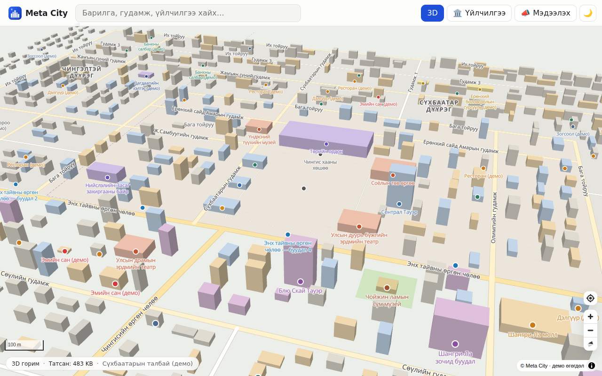
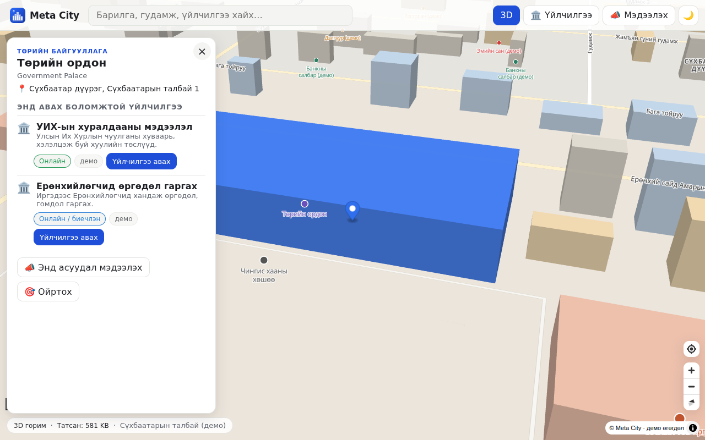

# Meta City — Улаанбаатар хотын digital twin

**Meta City** бол Улаанбаатар хотын цахим ихэр (digital twin) платформ. Иргэд вэб болон апп-аар орж,
хотоо **2D/3D**-ээр үзэж, бодит амьдралд авдаг **үйлчилгээгээ газрын зураг дээрх байгууллагаас шууд** авна.

> Эхний ээлж: Сүхбаатарын талбайн орчим (~3×3 км) дээр бүх гинжин хэлхээг (өгөгдөл → tile → загвар → апп)
> ажиллуулсан демо. Газрын зургийн суурийг **өөрсдөө** бүтээдэг — гадны map SDK/түлхүүрээс хамаарахгүй.

| | |
|---|---|
| 3D горим |  |
| Барилга → үйлчилгээ |  |

## Үндсэн зарчим: хот томроход апп ба дата өсөхгүй

1. **Апп дотор газрын зургийн өгөгдөл байхгүй.** Бүх өгөгдөл нэг `*.pmtiles` архивт (CDN дээр статик файл) байна;
   апп HTTP Range хүсэлтээр **зөвхөн харж буй tile-уудаа** татна. Tile сервер хэрэггүй.
2. **Нэг tile-ийн хэмжээ тогтмол хязгаартай** (`TILE_BUDGET`). Zoom бүрт юу орохыг `includeAtZoom` ерөнхийлөлт
   шийднэ; хэтэрвэл build унана. Тиймээс дэлгэц дээр харагдах өгөгдлийн хэмжээ хотын хэмжээнээс үл хамаарна.
3. **3D = 2D-тэй ижил vector tile.** Барилгын `height`/`levels` атрибутаас fill-extrusion босгоно — тусдаа 3D файл татдаггүй.
   2D/3D солиход дахин татдаггүй.
4. **Вэб = апп (PWA).** Суулгахад зөвхөн апп-ын shell (~450 KB gzip) татагдана. Дэлгүүрийн апп хэрэгтэй бол
   ижил bundle-ийг Capacitor-оор багцална (docs/ROADMAP.md).
5. **Фонт, загвар, өгөгдөл — бүгд өөрийн сервер дээр.** Гадны CDN/API түлхүүр шаардахгүй.

Хэмжилт (демо, 1280×800, эхний ачаалалт): shell 314 KB gzip JS + 12 KB CSS; газрын зураг + Кирилл фонт ≈ 480 KB;
нэг tile дунджаар 2–4 KB, хамгийн том нь 14 KB.

## Бүтэц (pnpm monorepo)

```
packages/schema     Давхарга/атрибутын ГЭРЭЭ (tile ↔ загвар ↔ апп), zoom-ийн хүрээ, ерөнхийлөлт, tile budget
packages/tiles      Газрын зургийн үйлдвэр: PMTiles v3 бичигч (өөрийн), GeoJSON→MVT, seed үүсгэгч,
                    хайлтын индекс, planetiler (OSM) схем + скриптүүд
packages/style      MapLibre загвар (өдөр/шөнө × 2D/3D), монгол нэршил, өөрийн glyph фонт
packages/services   Иргэдийн үйлчилгээний каталог (демо)
apps/web            Vite + Preact + MapLibre GL PWA
apps/mobile         Expo + MapLibre Native гар утасны апп (ижил tile/загвар/каталог) — apps/mobile/README.md
docs/               Архитектур, өгөгдлийн pipeline, замын зураг
```

## Онлайн демо

https://batmend.github.io/metacity/ — салбар руу push хийх бүрт GitHub Actions (`.github/workflows/pages.yml`) автоматаар байршуулна.
GitHub Pages нь private репод ажиллахгүй: репог public болгох (Settings → General → Change visibility) эсвэл
Cloudflare Pages / Vercel (private репод үнэгүй; build: `BASE_PATH=/ pnpm build`, output: `apps/web/dist`) ашиглана.
Утсан дээр нээгээд «Суулгах» (Add to Home Screen) хийвэл апп шиг суугдана.

## Эхлүүлэх

```bash
pnpm install
pnpm build          # tiles:demo → style:build → web build
pnpm preview        # http://127.0.0.1:4173
# эсвэл хөгжүүлэлт:
pnpm tiles:demo && pnpm dev
```

Шалгалт: `pnpm typecheck`, `pnpm test` (PMTiles бичигч протомапсын албан ёсны уншигчтай нийцэж буйг шалгана).

## Өгөгдөл

- **Демо (одоо):** `packages/tiles/src/seed/ub.ts` — Сүхбаатарын талбайн орчмын ойролцоо seed (нэртэй 20 барилга,
  ~850 процедурын барилга, гудамж, гол, парк, дүүргийн хил). Бүх feature `demo: 1` тэмдэгтэй. **Бодит хэмжилт биш.**
- **Бодит OSM:** `packages/tiles/scripts/build-osm.sh` — Монголын OSM хуулбарыг татаж, planetiler-ээр ижил схемд
  (`planetiler/metacity.yml`) tile үүсгэнэ. Дэлгэрэнгүй: [docs/DATA-PIPELINE.md](docs/DATA-PIPELINE.md).
- **Хотын өөрийн GIS давхарга** (кадастр, инженерийн шугам…): `tsx src/cli.ts geojson <dir>` — GeoJSON-оос шууд PMTiles.

## Баримт бичиг

- [docs/ARCHITECTURE.md](docs/ARCHITECTURE.md) — технологийн сонголт, шийдвэрүүд, хэмжээний баталгаа
- [docs/DATA-PIPELINE.md](docs/DATA-PIPELINE.md) — өгөгдлийн урсгал, OSM → PMTiles, өөрийн өгөгдөл оруулах
- [docs/ROADMAP.md](docs/ROADMAP.md) — дараагийн шатууд

## Лиценз, эх сурвалж

Код: MIT. Фонт: Noto Sans (OFL 1.1), glyph PBF — openmaptiles/fonts. Бодит өгөгдөл ашиглахад
© OpenStreetMap contributors (ODbL) attribution заавал.
